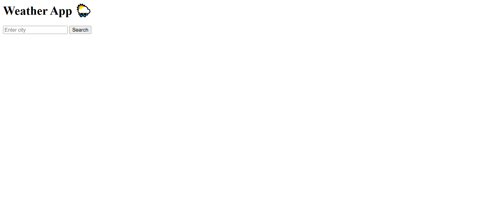

# 🌦️ Weather App - Day 1 Project 10

## 📌 Project Overview

This project is a simple and interactive **Weather App** created as part of my semester challenge to build 200 websites.

It allows users to search for any city and get real-time weather information using an API.

---

## 🎯 Features

* 🔍 Search Weather by City
* 🌡️ Display Temperature (°C)
* ☁️ Show Weather Condition
* ⚡ Real-time Data Fetching
* 🎨 Clean and Modern UI

---

## 🛠️ Technologies Used

* HTML5
* CSS3
* JavaScript
* Weather API (OpenWeather)

---

## 📂 Project Structure

```id="m3k9x2"
site-10-weather-app/
│
├── index.html
├── style.css
├── script.js
├── preview.png
└── README.md
```

---

## 📸 Preview

> ⚠️ Make sure `preview.png` is uploaded in the same folder



---

## 💡 Learning Outcome

* Learned how to use APIs
* Practiced async/await in JavaScript
* Worked with real-time data
* Improved JavaScript logic building
* Built a real-world application

---

## 🔥 Author

**Yash Patil**
Future Data Engineer 🚀

---

## ⭐ Note

This project is part of my goal to build **200 websites** to improve my development and programming skills.
